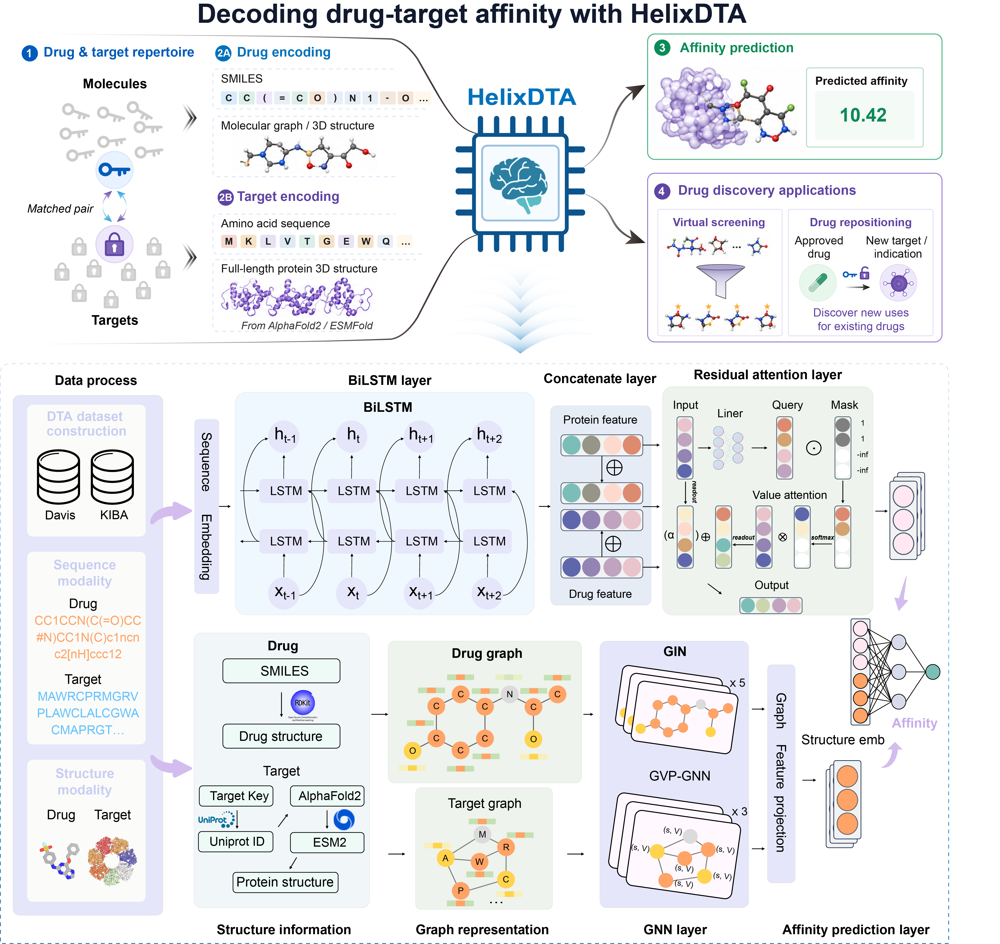

# HelixDTA: Full-length sequence–structure learning for robust and interpretable drug–target affinity prediction


**HelixDTA** is a dual-branch deep learning framework for drug-target affinity (DTA) prediction. The model integrates sequence context with full-length protein structural representations, allowing drug-target interactions to be modeled from complementary chemical and biological views. HelixDTA uses drug SMILES strings and protein amino-acid sequences as primary inputs, derives drug molecular graphs and protein residue graphs, and fuses sequence- and structure-aware representations for continuous affinity prediction.

HelixDTA is designed for robust DTA modeling across benchmark datasets and for structure-aware candidate prioritization in target-focused drug discovery workflows.

## Framework Overview

HelixDTA learns complementary representations from sequence and structural modalities through a parallel architecture:

- **Sequence branch:** Encodes drug SMILES strings and protein amino-acid sequences using bidirectional LSTM layers enhanced with residual attention modules.
- **Structure branch:** Encodes drug molecular graphs with graph neural networks and full-length protein residue graphs with geometric vector perceptron (GVP)-based structural encoders.
- **Representation fusion:** Combines sequence-derived and structure-derived embeddings through fully connected prediction layers to estimate continuous affinity values.
- **Interpretability support:** Uses attention-based visualization to highlight molecular regions that contribute to affinity prediction.



## Repository Structure

```text
HelixDTA/
|-- Dataset/             # Davis/KIBA datasets and protein structure files
|-- Model/               # Trained model checkpoints (.pt)
|-- Vocab/               # Vocabulary files (.pkl) for SMILES and protein sequences
|-- gvp/                 # Geometric Vector Perceptron modules
|-- build_vocab.py       # Vocabulary construction script
|-- dataset.py           # PyTorch Geometric dataset classes
|-- main.py              # Training, evaluation, and logging entry point
|-- model.py             # HelixDTA model architecture
|-- utils.py             # Data parsing, graph construction, and evaluation utilities
`-- README.md
```

## Installation

We recommend using Anaconda or Miniconda to manage the environment.

### 1. Clone the repository

```bash
git clone https://github.com/slouoo/HelixDTA.git
cd HelixDTA
```

### 2. Create and activate a conda environment

```bash
conda create -n helixdta python=3.8.20
conda activate helixdta
```

### 3. Install dependencies

```bash
pip install torch==2.4.1+cu124 --extra-index-url https://download.pytorch.org/whl/cu124
pip install torch-geometric==2.6.1 torch-cluster==1.6.3 torch-scatter==2.1.2 torch-sparse==0.6.18
pip install scikit-learn==1.3.2 scipy==1.10.1 pandas==2.0.3 networkx==3.1 atom3d==0.2.6
pip install rdkit==2022.9.5
```

## Dataset Preparation

HelixDTA is evaluated on two standard DTA benchmark datasets:

- **Davis**
- **KIBA**

The cleaned benchmark files and protein structure files are hosted externally because of file size constraints.

1. Download the prepared data archive from Google Drive:
   [https://drive.google.com/file/d/1osd9GRS1itQUi8e3NzBlZdnndllfIGxV/view?usp=sharing](https://drive.google.com/file/d/1osd9GRS1itQUi8e3NzBlZdnndllfIGxV/view?usp=sharing)
2. Extract the archive.
3. Place the cleaned dataset files, such as `davis_dataset_cleaned.csv` and `kiba_dataset_cleaned.csv`, in the project root directory or in the expected dataset path defined in `main.py`.
4. Place protein structure files in the corresponding dataset folders, for example:

```text
Dataset/
|-- davis/
|   `-- protein/
`-- kiba/
    `-- protein/
```

## Training and Evaluation

Run the main training script:

```bash
python main.py
```

The main configurable options are defined in `main.py`:

- `dataset_name`: choose `davis` or `kiba`
- `LR`: learning rate, default `1e-3`
- `batch_size`: default `64`
- `NUM_EPOCHS`: default `200`, with early stopping

## Outputs

Training and evaluation generate:

- **Model checkpoints:** saved in `./Model/`, for example `best_model_kiba_seed42.pt`
- **Evaluation summaries:** CSV files reporting mean squared error (MSE), concordance index (CI), and `rm2` metrics across random seeds

Example output files:

```text
Model/best_model_davis_seed42.pt
Model/best_model_kiba_seed42.pt
davis_result_nf.csv
kiba_result_nf.csv
```

## Reproducibility Notes

For fair comparison, please use the same preprocessing, dataset splits, and evaluation metrics described in the associated manuscript and Supporting Information. The reported benchmark results are based on repeated runs across random seeds and are evaluated using MSE, CI, and `rm2`.

## Citation

If you use HelixDTA in your research, please cite the associated manuscript:

```text
HelixDTA: Full-length protein sequence-structure learning for robust drug-target affinity prediction.
```

The full citation will be updated after publication.

## License

This project is released under the MIT License. See the `LICENSE` file for details.
